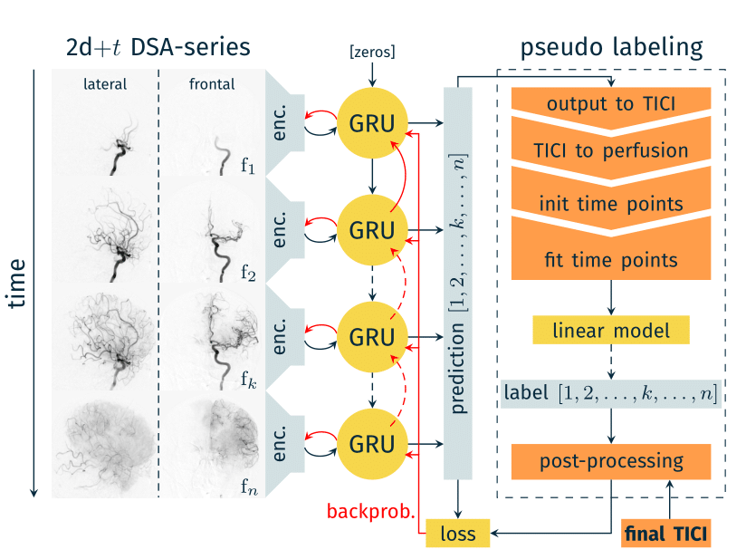
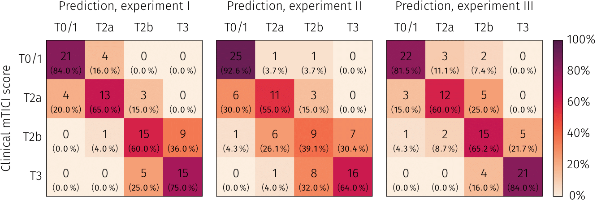

# DeepTICI

This repository contains the official code and model weights for the following STROKE [publication](https://doi.org/10.1161/STROKEAHA.120.033807) (cf. [About](#About) section for details):

```
@article{DeepTICI,
  title={Deep Learning–Based Automated Thrombolysis in Cerebral Infarction Scoring: A Timely Proof-of-Principle Study},
  author={Nielsen, Maximilian and Waldmann, Moritz and Fr{\"o}lich, Andreas and Flottmann, Fabian and Hristova, Evelin and Bendszus, Martin and Seker, Fatih and Fiehler, Jens and Sentker, Thilo and Werner, Ren{\'e}},
  journal={Stroke},
  volume={XX},
  number={X},
  pages={XXX--XXX},
  year={2021},
  publisher={Am Heart Assoc}
}
```

## Requirements
The code has been tested with Python 3.8 on Ubuntu 20.04 LTS. The following Python packages are required (lower versions may also be sufficient):
- efficientnet_pytorch >= 0.6
- torch >= 1.6 
- scikit-image >= 0.17.2
- PyYAML >= 5.4.1 
- opencv-python >= 4.5.2
- SimpleITK >= 2.0.2

## Installation
It is recommended to install the package in a separate virtual environment created with , e.g., [virtualenv](https://virtualenv.pypa.io/en/stable/) or [(mini)conda](https://docs.conda.io/projects/conda/en/latest/user-guide/install/index.html).

```sh
git clone https://github.com/IPMI-ICNS-UKE/DeepTICI
cd DeepTICI
pip install .
```

## Usage

Example usage for predicting a TICI score for a given two-views (i.e. lateral and frontal) DSA series (original M1 occlusion). Model weights from all experiments performed in our recent publication are included and can be seperately used for automatic TICI scoring (selectable via  predict_experiment_I/predict_experiment_III/predict_ensemble methods in configuration.yml). 

```python
from DeepTICI import predict


dcm_paths = ['/some/path/to/view/1', '/some/path/to/view/2']
tici_score = predict.predict_series(dcm_paths)
print(tici_score)
```

Fine tuning on personal data is supported:

```python
from DeepTICI import model
from DeepTICI.helper import ModelMode, OutputMode

# model init
model = model.TICIModelHandler(num_classes=5, feature_size= 1280, in_channels=3)

# forward pass
for data in data_loader:
    # DCM-series with shape: batch x time x 2 (views) x height x width
    img = data[0]
    series_lenghts = data[1]
    output = model(x=img, series_lenghts=series_lenghts, model_mode=ModelMode.train, output_mode=OutputMode.last_frame)
    # loss, backward-pass,  etc.
```
## <a name="About"></a> About
Implementation of the first fully automatic TICI-scoring system. The system is based on a combination of *encoder*, *GRU*
and *classifier*. Details of our proposed method can be found in the following MICCAI contribution:  
[Time Matters: Handling Spatio-Temporal Perfusion Information for Automated TICI Scoring](https://doi.org/10.1007/978-3-030-59725-2_9)


A detailed performance analysis is available in Stroke:  
[Deep Learning–Based Automated Thrombolysis in Cerebral Infarction Scoring: A Timely Proof-of-Principle Study](https://doi.org/10.1161/STROKEAHA.120.033807)


## Citation

```
@article{DeepTICI,
  title={Deep Learning–Based Automated Thrombolysis in Cerebral Infarction Scoring: A Timely Proof-of-Principle Study},
  author={Nielsen, Maximilian and Waldmann, Moritz and Fr{\"o}lich, Andreas and Flottmann, Fabian and Hristova, Evelin and Bendszus, Martin and Seker, Fatih and Fiehler, Jens and Sentker, Thilo and Werner, Ren{\'e}},
  journal={Stroke},
  volume={XX},
  number={X},
  pages={XXX--XXX},
  year={2021},
  publisher={Am Heart Assoc}
}
```

```
@inproceedings{TimeMatters,
  title={Time Matters: Handling Spatio-Temporal Perfusion Information for Automated TICI Scoring},
  author={Nielsen, Maximilian and Waldmann, Moritz and Sentker, Thilo and Fr{\"o}lich, Andreas and Fiehler, Jens and Werner, Ren{\'e}},
  booktitle={International Conference on Medical Image Computing and Computer-Assisted Intervention},
  pages={86--96},
  year={2020},
  organization={Springer}
}
```
